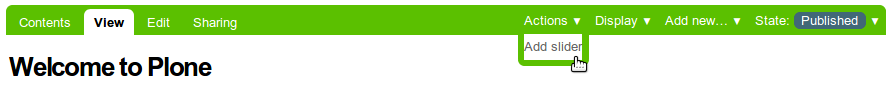
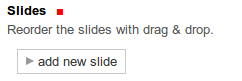
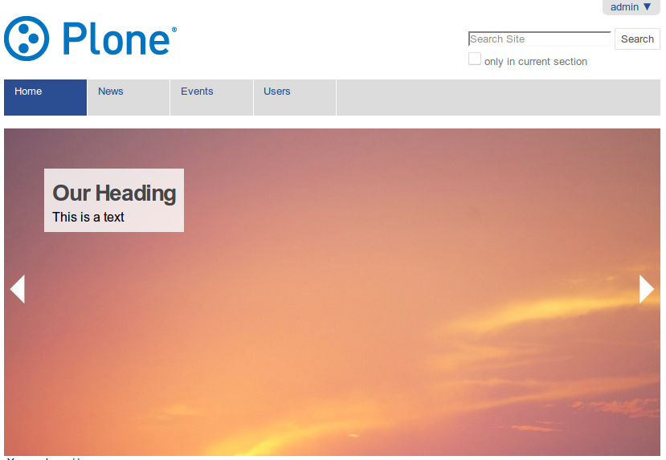

TX Slider
============
This product allows you to add slideshows to any page on a plone (version 4.3) site. It uses the cycle2 jquery library: http://malsup.com/jquery/cycle2/

See also configuration and layout `README`_:

.. _README: tx/tiles/README.rst

How to use
----------
On a page, click ``Actions`` -> ``Add slider``.

This opens a setting page for your slides. Slides can be added by clicking ``add new slide``.

Access the slider configuration through the ``Slider`` tab.

The slides are rendered by viewlets (at portaltop, belowcontenttitle or belowcontent).
	   

TODO
----
As of now only english and german translation is available.

Installation
------------
* add tx.slider to your eggs sections
* re-run buildout
* install the product in the Control Panel

Uninstall
---------
* Uninstall like normal

Credits and Contributions
-------------------------
* tx.tiles is based on collective.easyslider. Thanks for the ideas!
* University of Freiburg (Technische Fakultät) for sponsoring the package

